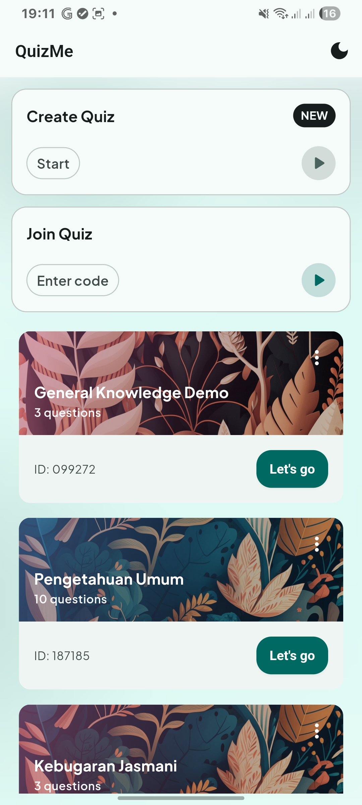
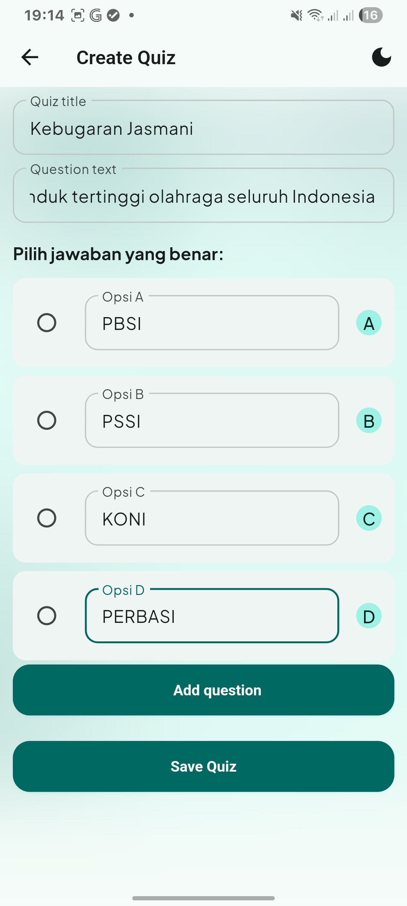
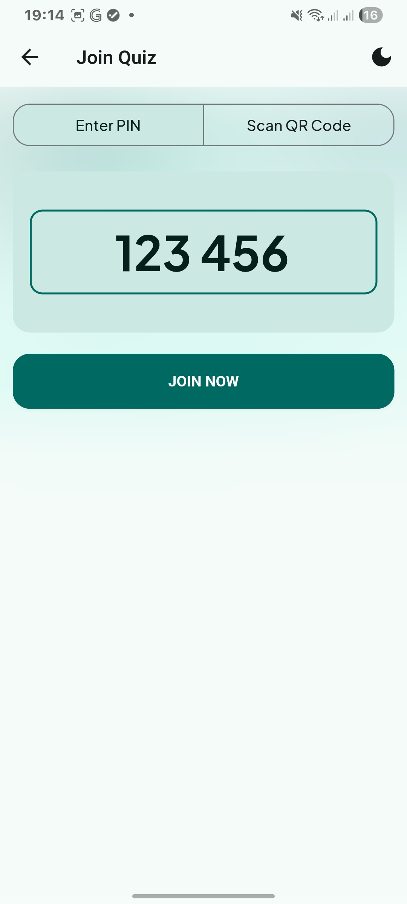
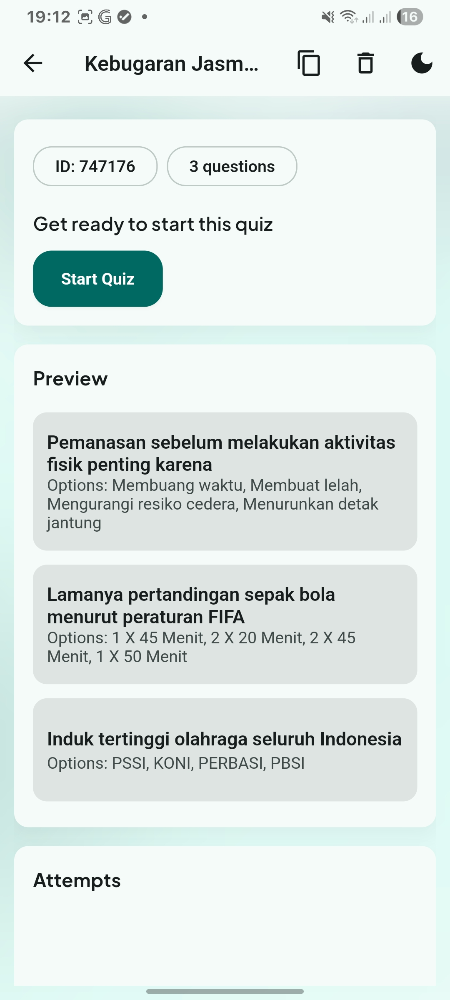
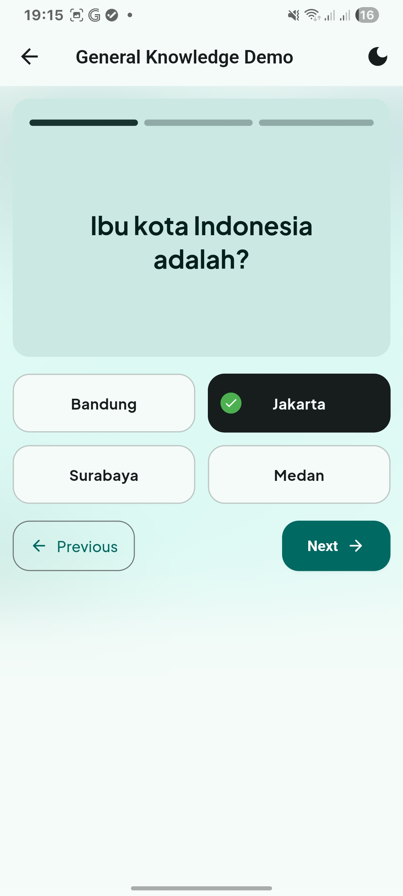
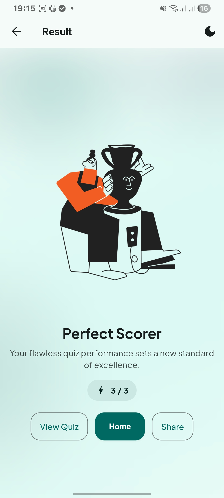

# QuizMe

QuizMe is a lightweight, offline quiz application built with Flutter. It uses go_router for navigation, provider for state management, and SharedPreferences for persistence. The UI follows a consistent outlined style with centralized design tokens and theming.

## Features

- Create and share quizzes with a fixed-length numeric code (default 6 digits)
- Play quizzes and view results with friendly, themed UI
- Attempt history per quiz and delete management
- Theming (light/dark) with a single brand seed color and custom font (Plus Jakarta Sans)
- Classroom-style quiz cards with image headers
- Home action tiles (Create / Join)
- Join with large centered PIN input and name prompt
- App icon and native splash generated from a single PNG asset

Planned / Optional
- QR scan flow for Join (UI placeholder included)

## Tech Stack

- Flutter (Material 3)
- go_router (routing)
- provider (state management)
- SharedPreferences (local persistence)

## Project structure

```
lib/
	main.dart                  # App entry, router, theme wiring
	core/
		constants.dart           # kQuizCodeLength (PIN length)
	models/
		quiz.dart                # Quiz, Question, Attempt models
	provider/
		app_state.dart           # AppState (quizzes, attempts, themeMode, load/save)
	screens/
		home.dart                # Landing with action tiles and quiz list
		create_quiz.dart         # Create quiz form
		join_quiz.dart           # Join via PIN (QR placeholder)
		quiz_detail.dart         # Quiz detail + attempts
		quiz_play.dart           # Play UI (question + options grid)
		quiz_result.dart         # Result UI (PNG illustrations)
	styles/
		tokens.dart              # Spacing, radius, durations, brand/accent colors
		theme.dart               # Material ThemeData built from seed color
	utils/
		id.dart                  # generateQuizCode() fixed-length numeric code
	widgets/
		app_scaffold.dart        # Standard layout + optional background
		background.dart          # Decorative gradient background
		dialogs.dart             # Name prompt, delete confirm, clipboard helper
		quiz_card.dart           # Classroom-style quiz card with header image
		action_card.dart         # Home action tiles

assets/
	fonts/                     # Plus Jakarta Sans
	background/                # Header PNGs for cards
	png/                       # Result illustrations
	quizme.png                 # App icon & splash source image
```

## Screenshots








## Routing

Routes are defined with go_router in `lib/main.dart`:

- `/` Home
- `/create` Create quiz
- `/join` Join quiz
- `/quiz/:id` Quiz detail
- `/quiz/:id/play` Play quiz
- `/quiz/:id/created` Created confirmation
- `/quiz/:id/result` Result

## State and persistence

`AppState` (provider) stores quizzes, attempts, and theme mode, and persists the data via SharedPreferences (JSON). New quiz IDs are generated with `generateQuizCode()` and uniqueness is enforced.

## Theming and design tokens

- Primary brand color is defined once in `lib/styles/tokens.dart`:
	- `AppPalette.lightSeed` / `AppPalette.darkSeed` (currently `#065750`)
- `lib/styles/theme.dart` builds light/dark ColorSchemes from the seed.
- Design tokens: spacing, radii, durations live in `tokens.dart` and are reused across the app.
- Font: Plus Jakarta Sans is bundled and set as the app font.

To change the brand color:
- Update `AppPalette.lightSeed` and `AppPalette.darkSeed` in `lib/styles/tokens.dart`.

## Assets, icon, and splash

- All assets are registered in `pubspec.yaml`.
- App icon and splash are generated from `assets/quizme.png` using:
	- `flutter_launcher_icons`
	- `flutter_native_splash`

If you replace `assets/quizme.png`, regenerate assets (optional commands):

```powershell
# Optional: regenerate launcher icons
dart run flutter_launcher_icons

# Optional: regenerate native splash
dart run flutter_native_splash:create
```

Notes:
- iOS icons require no alpha channel; this repo sets `remove_alpha_ios: true`.
- Web theme color is aligned to the brand color in `pubspec.yaml`.

## Development

Install dependencies:

```powershell
flutter pub get
```

Run on a device or Chrome:

```powershell
flutter run
```

Build Android APK:

```powershell
flutter build apk
```

Build iOS (on macOS):

```bash
flutter build ios
```

Run tests:

```powershell
flutter test
```

Static analysis:

```powershell
dart analyze
```

## Customization

- Quiz code length: set `kQuizCodeLength` in `lib/core/constants.dart`.
- ID generator: `lib/utils/id.dart` (digits-only, fixed length).
- Theme tweaks: adjust `lib/styles/theme.dart` and `tokens.dart`.
- Cards header images: `assets/background/` are chosen deterministically by quiz ID.

## Troubleshooting

- Windows builds with plugins require Developer Mode (symlink support). Enable via Settings → Privacy & security → For developers → Developer Mode.
- Icons/splash not updating: replace `assets/quizme.png`, regenerate (see commands above), then rebuild. On Android, uninstall/reinstall may be required; launchers can cache icons. On Web, clear site data or hard refresh (Ctrl+F5).
- Deprecated APIs: this project replaces `MaterialStateProperty` with `WidgetStateProperty` where needed and uses `withValues(alpha: ...)` instead of deprecated `withOpacity` patterns.

## License

This project is licensed under the terms of the LICENSE file included in the repository.

## Acknowledgements

- Flutter team and the authors of go_router, provider, SharedPreferences
- Plus Jakarta Sans font
